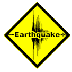
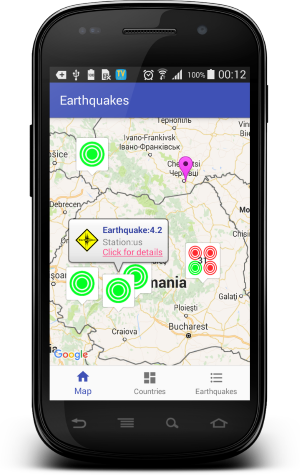
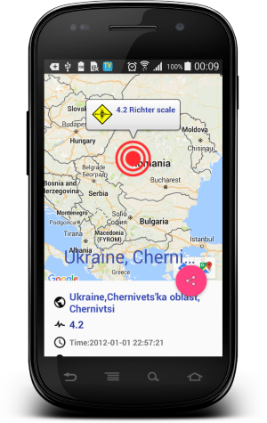
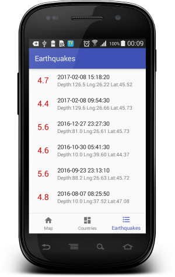

# Earthquakes

  

A simple Android application that showcases earthquakes on Google Maps.
 
 All data from API http://www.geonames.org

Main Fragment| Detail Activity | Earthquakes Fragment
-------------|-----------------| -------------
  |  | 

Developed By
-------
Igor Havrylyuk (Graviton57)

[1]: https://github.com/graviton57/Earthquakes.git
